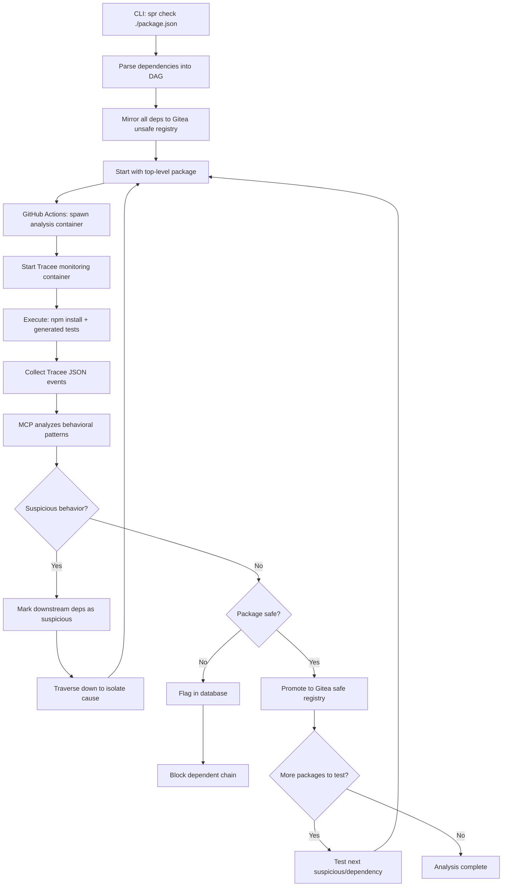

# HackEurope Security Track

It is a good idea to reason through Bluedot's track goal and provided articles to decide what to do rather than going off and making a project that doesn't fit the criteria for prizes.

> Build a security tool that detects, monitors, or mitigates AI-enabled threats before they scale.

The basic premise is that AI allows attackers to scale certain types of attacks by removing the constraint of human intelligence. In the context of security, this could be the mass production of social engineering and code.

> even a college student with AI access can now explore dangerous cyberattack strategies

While it is true that cybersecurity has been made more accessible, the quality remains generally the same. What has changed is volume.

Some possible scenarios for cyberattacks:

- POCs for CVEs are monitored and agents automatically exploit them before the majority of organizations have had time to patch.
- AI Agents create a high volume of legitimate pull requests with vulnerabilities hidden within (`xz-utils`)
- Biosecurity? Referenced by a Bluedot blog.
- Mass scanning of open source for vulnerabilities. A zero-day stash for attackers
- An attack on maintainers. Either through volume of false security reports to slow down security work, or social engineering drama to push maintainers out of a project

We can't really solve biosecurity without experience in the field. Mass static analysis is already overdone by existing companies like `socket.dev` and `snyk`. Pull request scanning is currently done by tools like `Coderabbit` and `GitGuardian`. There is also insufficient training data on social engineering which makes detecting intentional vulnerabilities difficult. Data processing requirements are massive and attackers can specifically run denial of service by giving too much context to parse for an LLM.

"before they scale." is an important point to consider. We can't really stop someone from scaling LLM usage especially with how good local models have gotten. We can only stop attacks from affecting the ecosystems they target. For example, an attacker monitoring the commits of `git` looking for unreleased CVE fixes would be entirely invisible until exploitation. While we can detect such fixes early, it is a hard sell to get everyone to upgrade in time.

A good example of scaling a cyberattack is the [Shai-Hulud worm](https://www.cisa.gov/news-events/alerts/2025/09/23/widespread-supply-chain-compromise-impacting-npm-ecosystem). The infection is obvious from behavioral characteristics, and the way to stop it would be to prevent any developer holding secrets from installing an infected package.

## Idea: LLM-driven runtime behavioral analysis

The vision is to have a mirror of NPM/PyPi/Cargo/etc where things have been reviewed much like the Debian model of package distribution. It should be compatible with existing flows and require minimal change while increasing resilience to supply chain attacks.

### User story

MVP user flow:

- I have an NPM project with a `package.json`
- Run `spr check ./package.json` CLI
- Parse dependency tree into DAG
- Recursively fetch dependencies and immediately mirror to Gitea **unsafe** registry (no testing yet)
- Test the full build first (top-level package with all dependencies)
- If suspicious behavior detected, mark downstream dependencies as suspicious for later resolution
- Traverse down the dependency tree to isolate the cause
- Once a package passes behavioral analysis, promote to Gitea **safe** registry
- If any package flagged, block entire dependency chain
- I set `npm config` to use the private registry
- The private registry automatically checks for new versions and makes new reproducible builds
- We aggregate data across different packages and detect odd changes in behavior and the spread of behavior. E.g. If a bunch of packages start calling to a specific domain, we know they're compromised.
- Behavior is visualized for presentation

A few things to look out for:

- [NPM packages can have non-NPM dependencies (e.g. Git or HTTPS which are not reproducible)](https://bsky.app/profile/dsherret.bsky.social/post/3lhmlurysh22b)
- [NPM install can run arbitrary `postinstall` scripts](https://cheatsheetseries.owasp.org/cheatsheets/NPM_Security_Cheat_Sheet.html)

### Implementation Notes

- **Behavioral Analysis Engine**: Tracee (Aqua Security)
  - Replaces eCapture - actively maintained, better container support
  - Captures all syscalls: `execve`, `open`, `openat`, `read`, `write`, `connect`, etc.
  - Reference: <https://aquasecurity.github.io/tracee/latest>

- **GitHub Actions Workflow**:
  - Base on `aquasecurity/tracee-action` (fork & customize)
  - Note: tracee-action is demo-only; we'll fork and maintain our own
  - Runs Tracee in container alongside package analysis container
  - Captures behavioral data during npm install + test execution

- **Analysis Pipeline**:
  1. Spawn isolated container with package under test
  2. Run Tracee scoped to that container
  3. Execute LLM-generated tests + npm install
  4. Collect Tracee JSON events
  5. MCP analyzes aggregated behavioral data
  6. Decision: approve/reject package

- **Storage & Registry**:
  - **Two-account Gitea strategy**: Separate "unsafe" and "safe" registries
    - **Unsafe registry**: Immediate mirroring of upstream packages (npm, PyPI, etc.) upon dependency resolution
    - **Safe registry**: Only approved packages after behavioral analysis
  - Promotion workflow: Packages move from unsafe → safe only after passing tests
  - PostgreSQL for behavioral data and package status
  - State tracking: check if package version exists in registry or flagged

- **LLM Integration**:
  - Generates tests per-package (in per-package directories)
  - MCP provides query interface for behavioral data aggregation
  - Reasons about anomalies: honeypot token access, suspicious domains, unexpected file writes
  - Access to binaries for reverse engineering the why. Prevents false positives and alert fatigue.

### Experimental notes

- **Tracee over eCapture**:
  - eCapture's `--cgroup_path` filtering doesn't work for SSL uprobes (only for TC/pcap mode)
  - Tracee has native container scoping: `--scope container=<id>`
  - Tracee captures ALL syscalls (execve, open, read, write, connect) vs eCapture's limited modules
  - JSON output ready for LLM consumption vs eCapture's text format

- **Container Strategy**:
  - Run package analysis in Container A
  - Run Tracee in Container B (privileged) scoped to Container A
  - Share events via volume mount or stdout capture
  - Alternative: Run Tracee on host, filter by container ID

- **MCP Integration**:
  - Custom MCP tool for querying Tracee JSON events
  - Aggregate: domain contacts, file reads/writes, command executions
  - Pattern matching: honeypot token access, suspicious network calls
  - Compare against baseline behavior for known-good packages
  - Raw data is too high volume, so some sort of query mechanism is needed.

### How this fits the challenge

- We are detecting the downstream effects of problems caused by LLMs on a layer that is much easier to scale.
- Behavioral analysis reduces down millions of lines of code down to a uniform representation that generalizes.
- We are using AI effectively to mitigate the cost and difficulty of making reproducible automatic.

### Further ideas

- Given a top down approach, when a dependency is flagged, we can use a bisection method to repeatedly dig 1 level deeper into flagged dependencies until we find the source. This significantly reduces the work needed on the most common happy routes.
