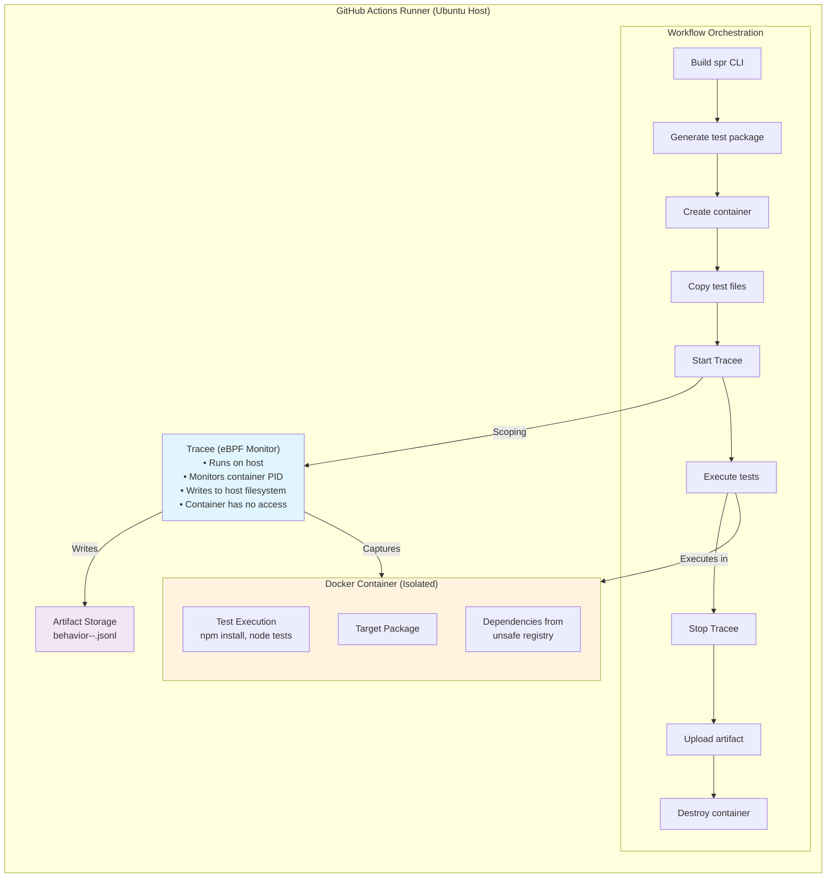

# Package Runner Design

## Execution Environment
This workflow runs entirely within **GitHub Actions** (Ubuntu runner). It is triggered manually via `workflow_dispatch` with package name and version inputs.

## Architecture Overview



## Critical Security Design
- **Tracee runs on host**, not in container
- **Tracee output** written to host filesystem (container has no access)
- Container is **isolated** - can only affect itself
- Even if malicious package escapes or crashes, Tracee data remains intact on host

## Workflow Inputs
- `package`: npm package name (e.g., `lodash`, `@sveltejs/kit`)
- `version`: Exact version to test (e.g., `4.17.21`)

## Detailed Execution Steps

### Phase 1: Setup (Host-side)
1. Checkout repository
2. Setup Go toolchain
3. Build spr CLI: `cd spr && go build -o spr ./cmd/spr/`
4. Download Tracee binary to host
5. Create output directory: `mkdir -p /tmp/tracee-out`

### Phase 2: Test Package Generation (Host-side)
Run: `./spr/spr test generate --package <name> --version <version> --output ./test-pkg`

Generates:
- `./test-pkg/<package>@<version>/install/` - npm install test
- `./test-pkg/<package>@<version>/import/` - import/initialization test  
- `./test-pkg/<package>@<version>/prototype/` - prototype pollution test
- `./test-pkg/<package>@<version>/cli/` - CLI execution test (only if package has bin field)

### Phase 3: Container Setup (Host-side)
Create Docker container:
```bash
docker run -d --name test-env --network host \
  -e NPM_CONFIG_REGISTRY=https://git.duti.dev/api/packages/acheong08/npm/ \
  node:20 sleep 3600
```

**Registry Configuration:**
- Container uses `git.duti.dev` registry (unsafe registry)
- Dependencies resolve from our pre-uploaded packages
- Ensures reproducible builds (same versions every time)

### Phase 4: Behavioral Analysis (Host orchestrates, Container executes)

**Start Tracee monitoring (host):**
```bash
CONTAINER_PID=$(docker inspect test-env --format '{{.State.Pid}}')
sudo ./dist/tracee \
  --scope container=$CONTAINER_PID \
  --events execve,execveat,open,openat,connect,net_packet_dns_request \
  --output json:/tmp/tracee-out/behavior.jsonl &
```

**Execute tests sequentially (commands sent to container):**

1. **Install Test:**
   ```bash
   docker cp ./test-pkg/<package>@<version>/install/. test-env:/test/
   docker exec test-env sh -c "cd /test && npm install"
   ```
   - Captures: preinstall, postinstall, prepare scripts
   - Captures: node-gyp native compilation

2. **Import Test:**
   ```bash
   docker cp ./test-pkg/<package>@<version>/import/. test-env:/test/
   docker exec test-env sh -c "cd /test && node index.js"
   ```
   - Captures: module initialization code
   - Captures: top-level IIFE execution

3. **Prototype Pollution Test:**
   ```bash
   docker cp ./test-pkg/<package>@<version>/prototype/. test-env:/test/
   docker exec test-env sh -c "cd /test && node test-prototype.js"
   ```
   - Captures: prototype modifications
   - Captures: triggered polluted properties

4. **CLI Test (conditional):**
   ```bash
   docker cp ./test-pkg/<package>@<version>/cli/. test-env:/test/
   docker exec test-env sh -c "cd /test && timeout 30s node test-cli.js"
   ```
   - Only if package has CLI binary
   - 30s timeout for long-running processes

**Stop Tracee (host):**
```bash
sudo kill $TRACEE_PID
wait $TRACEE_PID
```

### Phase 5: Artifact Upload (Host-side)
Upload single file: `/tmp/tracee-out/behavior.jsonl`

Artifact name: `behavior-<package>-<version>-<run_id>.jsonl`

**Artifact contains:**
- All syscalls from all test phases
- File access patterns
- Network connections
- DNS queries
- Process executions

## Error Handling Strategy
- **Test failures don't stop workflow:** Malicious packages may crash - we still want the Tracee data showing what they did before crashing
- **Always stop Tracee:** Use `trap` or `always()` to ensure Tracee stops even if tests fail
- **Always upload artifact:** Even if all tests crash, upload whatever Tracee captured
- **Container cleanup:** Always destroy container at end (`docker rm -f`)

## Post-Workflow Analysis (Local)
After workflow completes:
1. Download artifact: `gh run download <run-id> -n behavior-<pkg>-<ver>-<run_id>.jsonl`
2. Analyze with LLM via MCP tools
3. Generate JSON report
4. Visualize in frontend
5. Promote safe packages from unsafe → safe registry

## Key Design Decisions
1. **Single Tracee session:** All tests run under one Tracee instance = single artifact file
2. **Sequential execution:** Tests run one after another (not parallel) to avoid interference
3. **Host-side Tracee:** Runs outside container for security (container can't tamper with output)
4. **Reproducible builds:** Uses our unsafe registry, not npm directly
5. **Continue on failure:** Captures partial behavior even if tests crash
